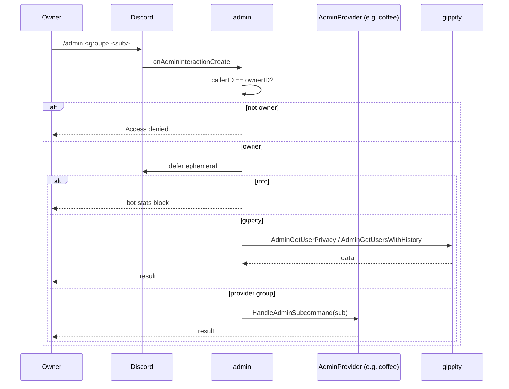

# admin

Directory `internal/admin`. Not a `bot.Module`; started via `admin.Start`.

Owner-only `/admin` command. Dispatches to built-in subcommands (`info`, `gippity privacy|history`) and to registered `bot.AdminProvider` modules (e.g. coffee).

- `RegisterProvider` must run before `Start` (command tree is built from providers).
- All responses ephemeral.

## Dispatch flow

