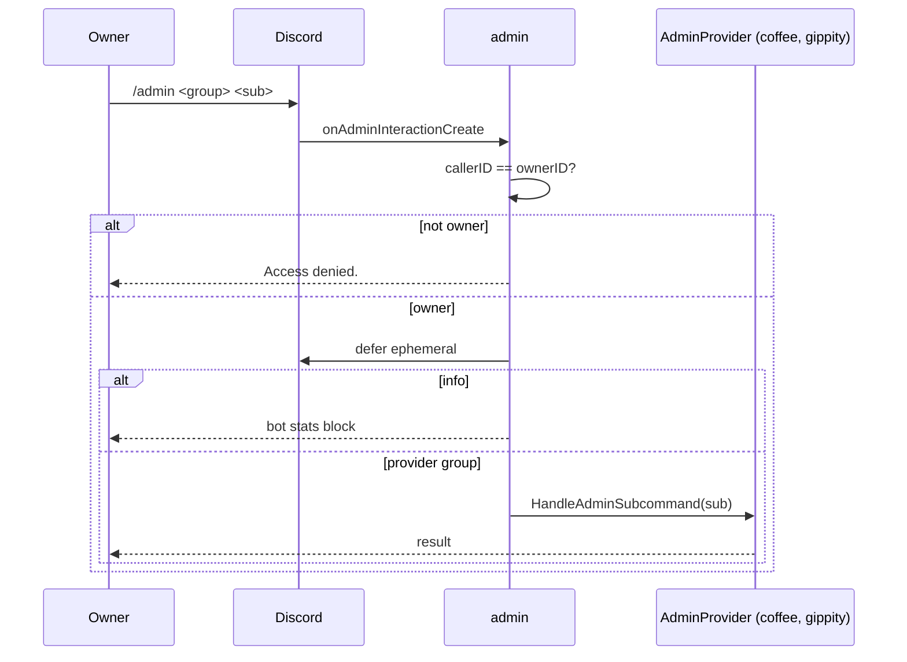

# admin

Directory `internal/admin`. Not a `bot.Module`; started via `admin.Start`.

Owner-only `/admin` command. Dispatches the built-in `info` subcommand and delegates group subcommands to registered `bot.AdminProvider` modules (coffee, gippity).

- `RegisterProvider` must run before `Commands()` (the command tree is built from providers).
- All responses ephemeral.

## Dispatch flow

```mermaid
sequenceDiagram
    participant O as Owner
    participant D as Discord
    participant A as admin
    participant P as AdminProvider (coffee, gippity)

    O->>D: /admin <group> <sub>
    D->>A: onAdminInteractionCreate
    A->>A: callerID == ownerID?
    alt not owner
        A-->>O: Access denied.
    else owner
        A->>D: defer ephemeral
        alt info
            A-->>O: bot stats block
        else provider group
            A->>P: HandleAdminSubcommand(sub)
            P-->>O: result
        end
    end
```
