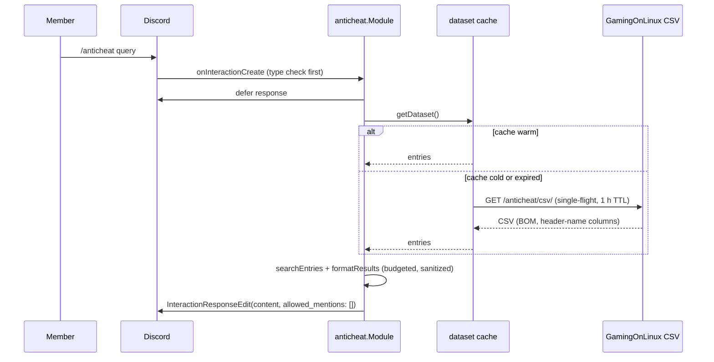

# anticheat

Directory `internal/anticheat`. Implements `bot.Module`.

Searches GamingOnLinux's Linux/Steam Deck anti-cheat compatibility list
(<https://www.gamingonlinux.com/anticheat/>, CC BY 4.0) for a game title or an
anti-cheat vendor and answers with the entry's status, anti-cheat, Proton and
native Linux support, sanitized notes and the source link.

- Command: `/anticheat query:<game or vendor>` (required, autocomplete).

## Data source

The machine-readable export <https://www.gamingonlinux.com/anticheat/csv/> is
fetched as CSV, not scraped: columns are resolved by header name, so a
reordered or extended export keeps working and a missing optional column stays
empty. The response body is capped at 4 MiB and fetched with a 15 s timeout and
a `gidbig` user agent.

## Behaviour

- Matching is case- and whitespace-insensitive, ranked exact > prefix > word
  start > substring over the game title. Only when no title matches does it
  fall back to the anti-cheat column, so `BattlEye` lists BattlEye games without
  polluting title searches. Commas inside a title are data
  (`Warhammer 40,000: Space Marine 2`), only the anti-cheat column is treated as
  a multi-value cell.
- Up to five entries per reply; the reply reserves the source line and the
  remainder count first and then fits complete result blocks into the rest of
  Discord's 2000-rune limit, so neither is ever clipped away.
- Every rendered field is bounded — title 120 runes, status 60, the other
  fields 120, notes 200 — so one block always stays far below the budget.
- Untrusted text (the reflected query and every CSV cell) is neutralized before
  it reaches the message body: backticks become apostrophes, every `@` is split
  with a zero-width space, markup becomes `text (<url>)` and replies are sent
  with `allowed_mentions: {"parse": []}`.
- Autocomplete offers ranked titles with their status from the warm cache only,
  so it stays inside Discord's 3 s window.

## Flow

The listener is registered globally, so it checks `i.Type` before reading the
command data: `ApplicationCommandData()` panics on button, select, modal and
ping interactions, and the dispatcher does not recover a panicking handler.

`Background()` warms the cache at startup and re-checks it every 15 minutes, so
a cold cache does not have to be filled from a command; failed fetches are not
cached.
