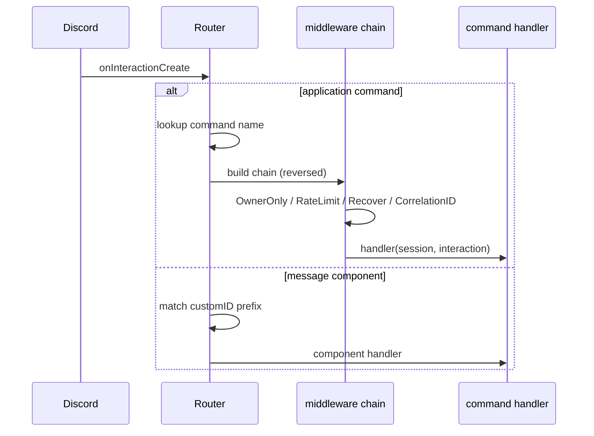

# bot

Directory `internal/bot`. Shared module framework. Not user-facing.

- `module.go` – `Module` interface (`Name`, `Init`, `Commands`, `Listeners`, `Components`, `Background`, `Shutdown`) and `AdminProvider`.
- `deps.go` – `Deps` (Session, Config, LLM, Logger, OwnerID).
- `router.go` – command/component dispatch with middleware. No-op until modules migrate.
- `bot.go` – `Bot` wiring Router + supervisor.
- `background.go` – `BackgroundSupervisor` runs panic-safe goroutines.
- `middleware.go` – `OwnerOnly`, `RateLimit`, `Recover`, `WithCorrelationID`.

## Interaction dispatch

`BackgroundSupervisor.Start` launches each task in a goroutine and recovers panics; `Wait` blocks until all return.
