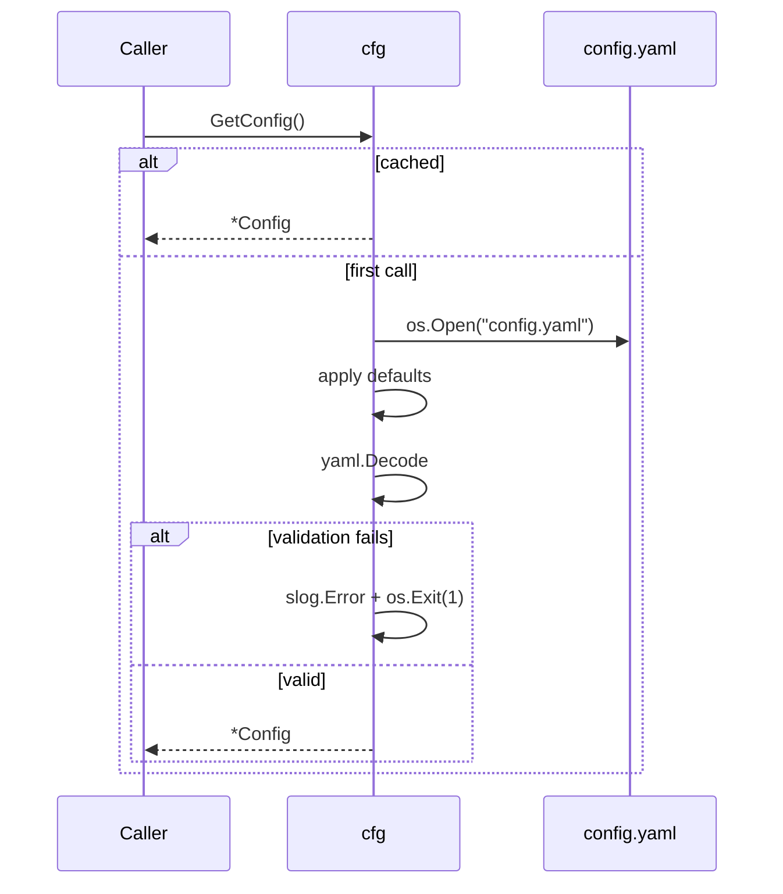

# cfg

Directory `internal/cfg`. YAML config load + validation.

- `GetConfig()` – lazy singleton, calls `loadFile()` once.
- `loadFile()` – opens `config.yaml`, exits process on error.
- `decodeConfig()` – defaults + required-field validation.

Required: `discord.token`, non-empty `gippity.allowed_guilds`. `web.session_secret` required when `web.port != 0`. Defaults: soundboard queue depth 6, gippity rate limit 30/h.

## Load flow

