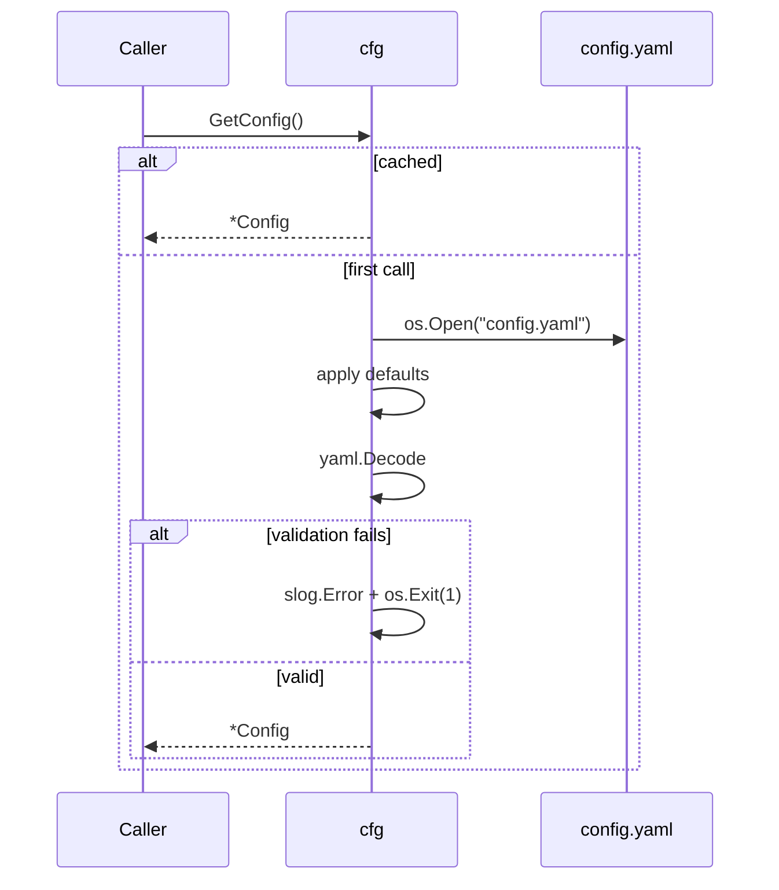

# cfg

Directory `internal/cfg`. YAML config load + validation.

- `GetConfig()` – lazy singleton, calls `loadFile()` once.
- `loadFile()` – opens `config.yaml`, exits process on error.
- `decodeConfig()` – defaults + required-field validation.

Required: `discord.token`, non-empty `gippity.allowed_guilds`. `web.session_secret` required when `web.port != 0`. Defaults: soundboard queue depth 6, gippity reply rate limit 30/h, gippity classifier rate limit 30/h, gippity `reply_in_thread`/`respond_to_all_messages` false, gippity `classifier_names`/`debug_channel` empty (the classifier already knows the bot's own username and display name; an empty debug channel restricts nothing), gippity `tools.enabled` false, gippity `tools.max_iterations` 3.

Optional `web.eso` tunes the `/api/eso` guards (`rate_limit_burst` 5, `rate_limit_per_minute` 30, `max_concurrent_requests` 4, `request_timeout_seconds` 15). Nothing is validated: an omitted or non-positive key keeps the default, which the web server resolves in `resolveEsoLimits`.

## Load flow

```mermaid
sequenceDiagram
    participant Caller
    participant C as cfg
    participant FS as config.yaml

    Caller->>C: GetConfig()
    alt cached
        C-->>Caller: *Config
    else first call
        C->>FS: os.Open("config.yaml")
        C->>C: apply defaults
        C->>C: yaml.Decode
        alt validation fails
            C->>C: slog.Error + os.Exit(1)
        else valid
            C-->>Caller: *Config
        end
    end
```
