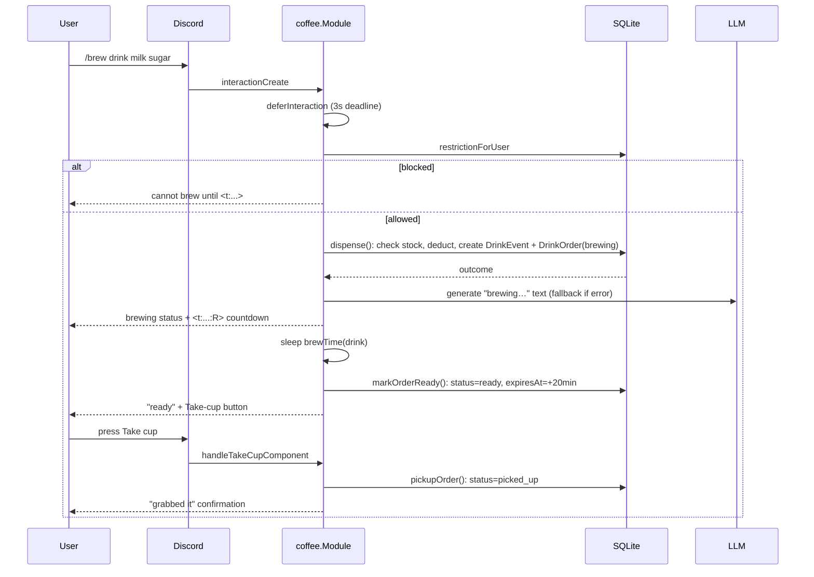

# coffee

Directory `internal/coffee`. Implements `bot.Module` + `bot.AdminProvider`.

Coffee machine economy per guild: beans, water, milk, grounds, tea bags. Tracks drink events, refills, grounds emptied, slackers, pickup violations.

- Commands: `/brew` (+ interactive menu), `/coffeemachine refill|empty|status|stats`, `/setbeverage`.
- Components: drink menu, Take-cup button (opener-only).
- Persistence: GORM/SQLite (`store.go`, `machine.go`).
- Background: `runOrderExpiry` expires unclaimed ready drinks.

## Brew + pickup flow

Unclaimed ready drinks expire via the background sweep; expiry records a `PickupViolation`, enough violations set a `BrewRestriction`.
