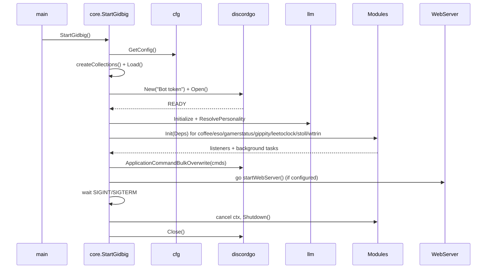
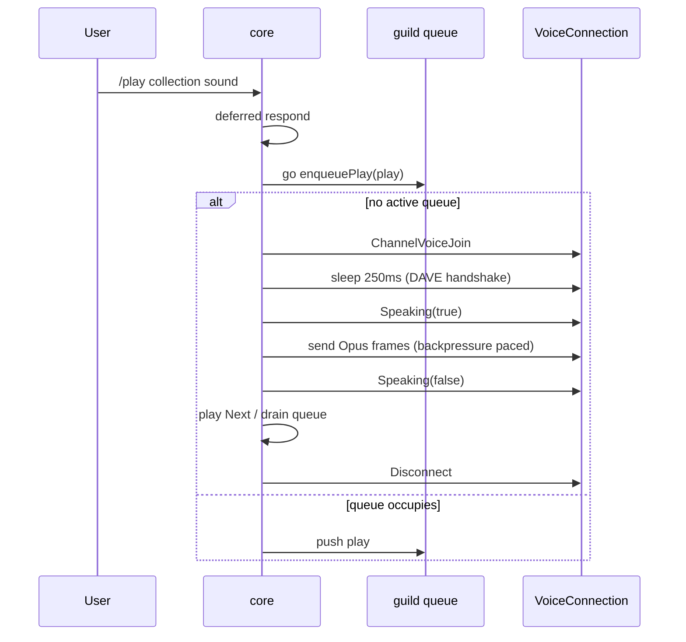

# core

Package `gidbig`, directory `internal/core`. Composition root.

- `cmd.go` – `StartGidbig`: builds session, wires modules, registers slash commands, waits for signal, shuts down.
- `soundboard.go` / `soundboard_init.go` – scan/load `audio/*.dca`, per-guild play queue.
- `slashcmd.go` – `/list`, `/uptime`, `/play`.
- `webserver.go` – optional OAuth session web UI, sound + eso APIs.
- `wsdeadline.go` – read/write deadlines on discordgo websockets.
- `version.go`, `discordlog.go`, `structs.go`.

## Startup sequence

## Sound playback

