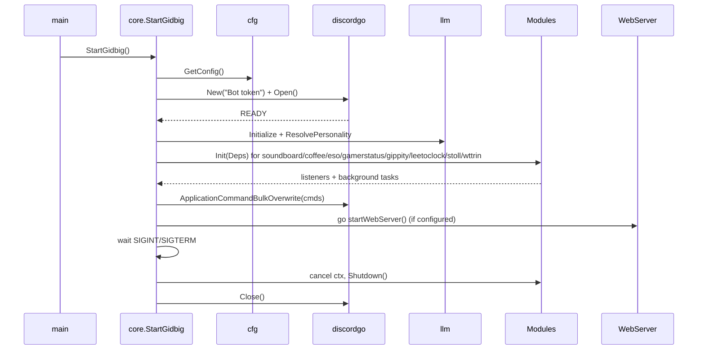

# core

Package `gidbig`, directory `internal/core`. Composition root.

- `cmd.go` – `StartGidbig`: builds session, wires modules, registers slash commands, waits for signal, shuts down.
- `slashcmd.go` – `/uptime`.
- `status.go` / `status_users.go` – `/status` snapshot collection and rendering.
- `webserver.go` – optional OAuth session web UI, sound + eso APIs.
- `wsdeadline.go` – read/write deadlines on discordgo websockets.
- `version.go`, `discordlog.go`, `structs.go`.

The soundboard lives in `internal/soundboard`; the web server reaches it through
the module's exported `Collections`, `Enqueue` and `QueueStatus` API.

## Startup sequence

```mermaid
sequenceDiagram
    participant main
    participant core as core.StartGidbig
    participant cfg
    participant dg as discordgo
    participant llm
    participant mod as Modules
    participant web as WebServer

    main->>core: StartGidbig()
    core->>cfg: GetConfig()
    core->>dg: New("Bot token") + Open()
    dg-->>core: READY
    core->>llm: Initialize + ResolvePersonality
    core->>mod: Init(Deps) for soundboard/coffee/eso/gamerstatus/gippity/leetoclock/stoll/wttrin
    mod-->>core: listeners + background tasks
    core->>dg: ApplicationCommandBulkOverwrite(cmds)
    core->>web: go startWebServer() (if configured)
    core->>core: wait SIGINT/SIGTERM
    core->>mod: cancel ctx, Shutdown()
    core->>dg: Close()
```
