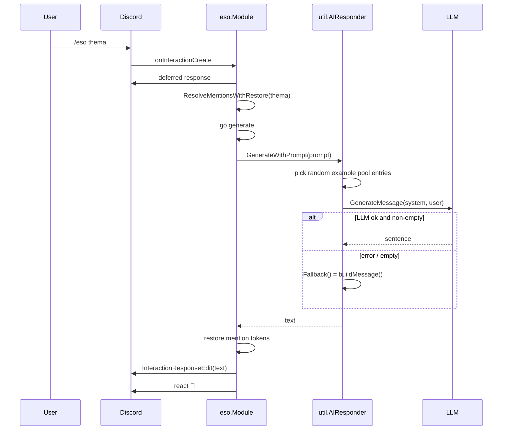

# eso

Directory `internal/eso`. Implements `bot.Module`.

Generates one sentence of esoteric German nonsense via LLM with few-shot examples. Falls back to a deterministic generator (`buildMessage`) when the LLM fails or returns empty.

- Command: `/eso [thema]`.
- Also exposed over HTTP: `GET/POST /api/eso` (web server), via `Module.GenerateText`.
- Core helper: `util.AIResponder`.

## Command flow

