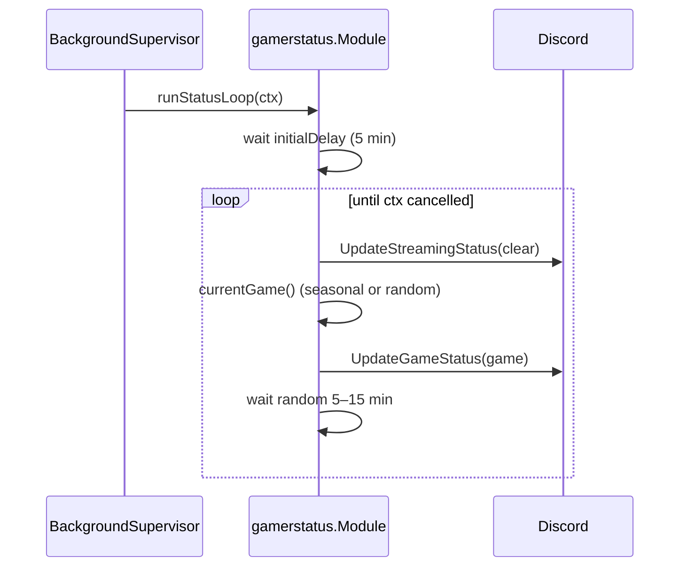

# gamerstatus

Directory `internal/gamerstatus`. Implements `bot.Module`.

Rotates the bot's "playing" status through a retro-game list. On seasonal dates (`util.Season`) shows a themed status instead. No commands.

## Background rotation

Seasonal overrides: Halloween, April Fools, New Year, Easter, Christmas; otherwise random game from `games`.
