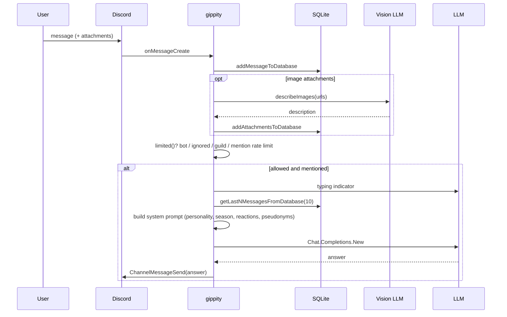

# gippity

Directory `internal/gippity`. Legacy module: wired via `gippity.Start`, not `bot.Module` (started directly in `core/cmd.go`).

LLM chat for Discord: answers when the bot is mentioned, keeps per-channel history, describes image attachments, honors per-user privacy, rate-limits mentions.

- Command: `/gippity privacy on|off`.
- Storage: SQLite `gippity.db` (`chat_history`, `chat_history_edits`, `chat_attachments`, privacy).
- Rate limit: `rate_limit_messages_per_hour` per user.

## Message answer flow

Edited messages update `chat_history_edits` (versioned). Message replies inject a system note with the referenced message content.
