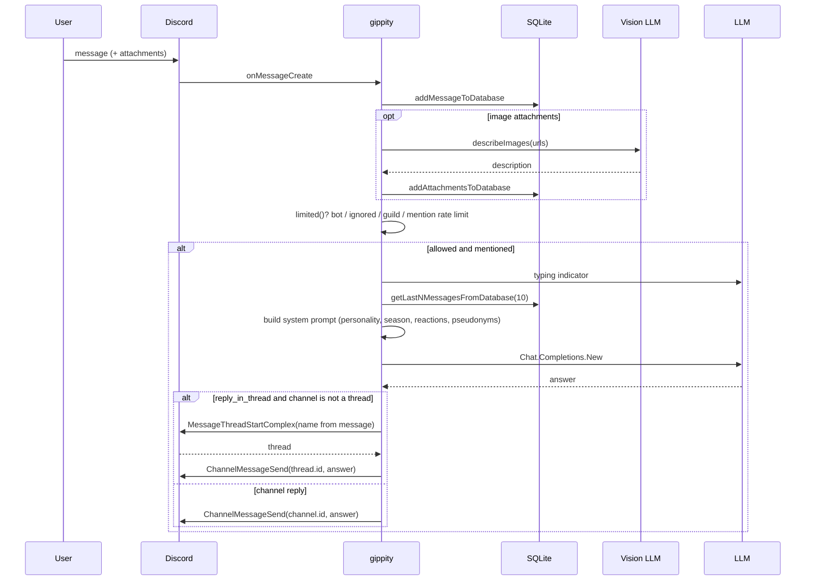

# gippity

Directory `internal/gippity`. Legacy module: wired via `gippity.Start`, not `bot.Module` (started directly in `core/cmd.go`).

LLM chat for Discord: answers when the bot is mentioned, keeps per-channel history, describes image attachments, honors per-user privacy, rate-limits mentions.

- Command: `/gippity privacy on|off`.
- Storage: SQLite `gippity.db` (`chat_history`, `chat_history_edits`, `chat_attachments`, privacy).
- Rate limit: `rate_limit_messages_per_hour` per user.
- Reply target: `reply_in_thread` (default `false`) posts the answer inside a public thread started on the mentioning message instead of the channel. The thread name is derived from that message (mentions, backticks and control/format characters stripped, clamped to 100 characters). Messages that already arrive in a thread are answered in place, since Discord does not nest threads, and a failed thread start falls back to the channel. Rate-limit notices follow the same setting.

## Message answer flow

```mermaid
sequenceDiagram
    participant U as User
    participant D as Discord
    participant G as gippity
    participant DB as SQLite
    participant V as Vision LLM
    participant L as LLM

    U->>D: message (+ attachments)
    D->>G: onMessageCreate
    G->>DB: addMessageToDatabase
    opt image attachments
        G->>V: describeImages(urls)
        V-->>G: description
        G->>DB: addAttachmentsToDatabase
    end
    G->>G: limited()? bot / ignored / guild / mention rate limit
    alt allowed and mentioned
        G->>L: typing indicator
        G->>DB: getLastNMessagesFromDatabase(10)
        G->>G: build system prompt (personality, season, reactions, pseudonyms)
        G->>L: Chat.Completions.New
        L-->>G: answer
        alt reply_in_thread and channel is not a thread
            G->>D: MessageThreadStartComplex(name from message)
            D-->>G: thread
            G->>D: ChannelMessageSend(thread.id, answer)
        else channel reply
            G->>D: ChannelMessageSend(channel.id, answer)
        end
    end
```

Edited messages update `chat_history_edits` (versioned). Message replies inject a system note with the referenced message content.
