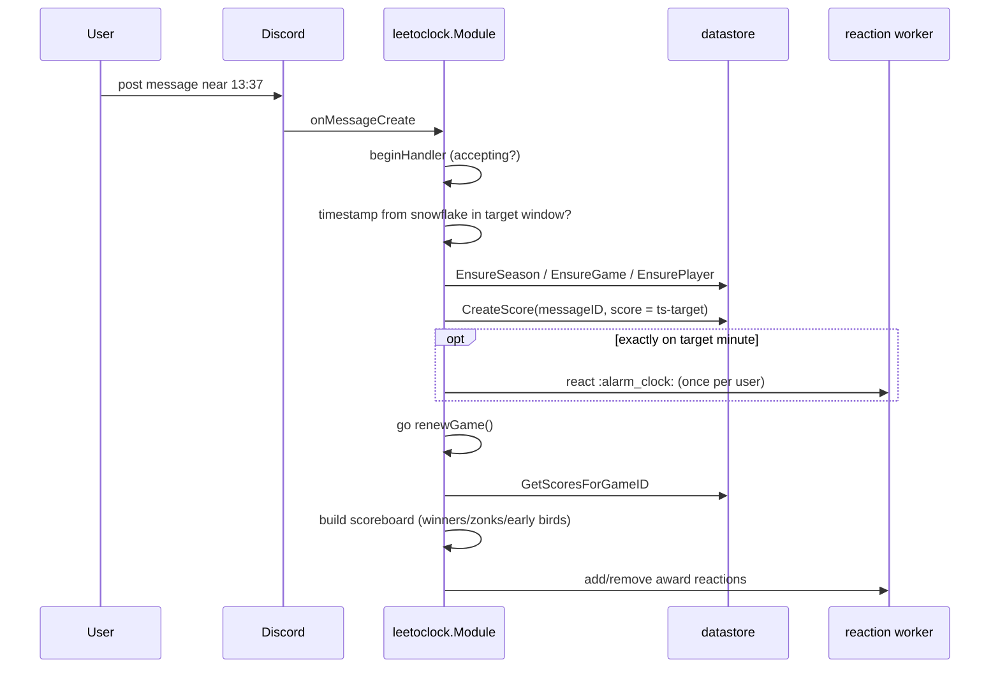

# leetoclock

Directory `internal/leetoclock`. Implements `bot.Module`. No slash commands.

Daily game: players race to post exactly when the clock hits `13:37` (configurable). Score = ms offset from target (can be negative). Keeps a scoreboard, reacts with award emojis, announces winners.

- Store: SQLite via `leetoclock/util/datastore`.
- Emojis: configurable guild IDs, else Unicode fallback.
- Debug mode: one minute after start, fast tick.

## Scoring flow

Background loops: `runPreparationLoop` announces the target time; `runWinnerLoop` posts the scoreboard after the round and resets state.
