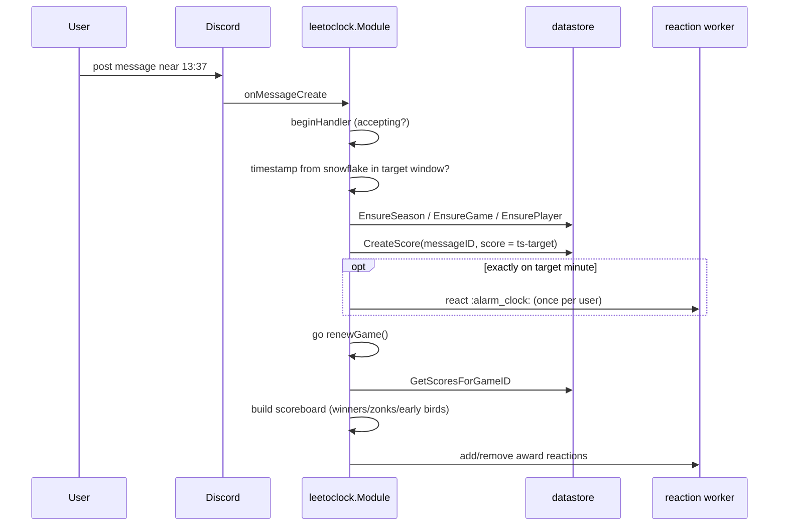

# leetoclock

Directory `internal/leetoclock`. Implements `bot.Module`.

Daily game: players race to post exactly when the clock hits `13:37` (configurable). Score = ms offset from target (can be negative). Keeps a scoreboard, reacts with award emojis, announces winners.

- Store: SQLite via `leetoclock/util/datastore`.
- Emojis: configurable guild IDs, else Unicode fallback.
- Debug mode: one minute after start, fast tick.

## Record commands

- `/leetoclock top` shows this server's ten best distinct players for the current calendar month. Example: `/leetoclock top period:7d scope:global public:true` posts the last seven days' top players across all servers in the invoking channel.
- `/leetoclock player` shows your current-month records in this server, including valid attempt count and ten best scores. Example: `/leetoclock player user:@someone period:all scope:global` looks up that player's records across servers without linking to other servers' messages.

Both commands default to private (ephemeral) responses. Set `public:true` to share in the invoking channel. Set `scope:global` for cross-server records; otherwise results cover all channels in the current server. Global results show server names when available and never link to cross-server messages. Period choices: `month` (current calendar month), `7d` (past 7 days), `30d` (past 30 days), `all` (all stored history). Only scores at or after the target time count; early-bird negative scores are excluded.

Score-history reads normalize older game rows whose guild, date, and season fields were shifted in the database. No production data migration is required; both historical and current records participate in period and server filters.

## Scoring flow

Background loops: `runPreparationLoop` announces the target time; `runWinnerLoop` posts the scoreboard after the round and resets state.
