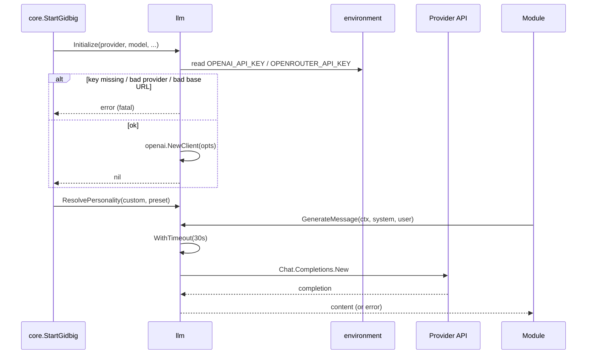

# llm

Directory `internal/llm`. Shared OpenAI-compatible client + persona. Not user-facing.

- `Initialize` – builds client from `provider` (`openai`/`openrouter`), reads `OPENAI_API_KEY`/`OPENROUTER_API_KEY`, sets base URL, timeout, models.
- `GenerateMessage` / `GenerateMessageWith` – single-turn completion, 30s timeout, 150 max tokens.
- `DetectChannelLanguage` – LLM language detect over last 20 channel messages, 1h cache.
- `Personality` / `ResolvePersonality` – custom string > preset (`hal`, `schemer`, `dry`, `genalpha`) > built-in default.
- `Model`, `VisionModel`, `GetClient`.

## Client init + generation

