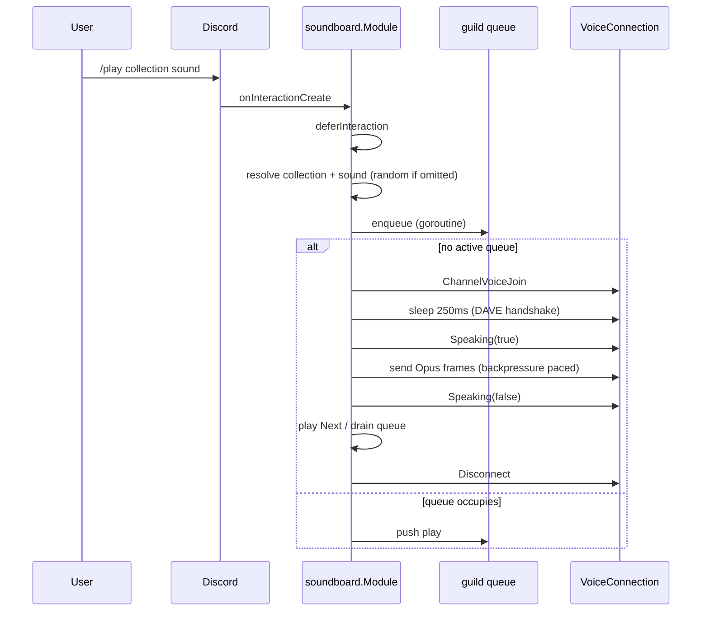

# soundboard

Directory `internal/soundboard`. Implements `bot.Module` and `bot.StatsProvider`.

Scans `audio/*.dca` into per-prefix collections and plays them in voice channels, one queue per guild.

- Commands: `/list`, `/play collection [sound]`.
- Lifecycle: `Init` loads the `.dca` files and applies `soundboard.queue_max_depth`; `Shutdown` has nothing to release (voice connections close when a queue drains).
- Exported API for the web server: `Collections()`, `Enqueue(user, guild, command, soundname)`, `QueueStatus()`.
- Stats: sound/collection/queue counters in `/status`.

## Playback flow

