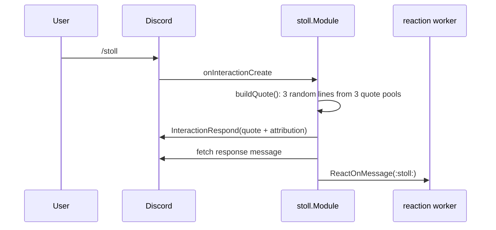

# stoll

Directory `internal/stoll`. Implements `bot.Module`.

Returns a random Dr. Axel Stoll quote. Pure static data (`quotes`), no external calls.

- Command: `/stoll`.

## Command flow

```mermaid
sequenceDiagram
    participant U as User
    participant D as Discord
    participant S as stoll.Module
    participant R as reaction worker

    U->>D: /stoll
    D->>S: onInteractionCreate
    S->>S: buildQuote(): 3 random lines from 3 quote pools
    S->>D: InteractionRespond(quote + attribution)
    S->>D: fetch response message
    S->>R: ReactOnMessage(:stoll:)
```
