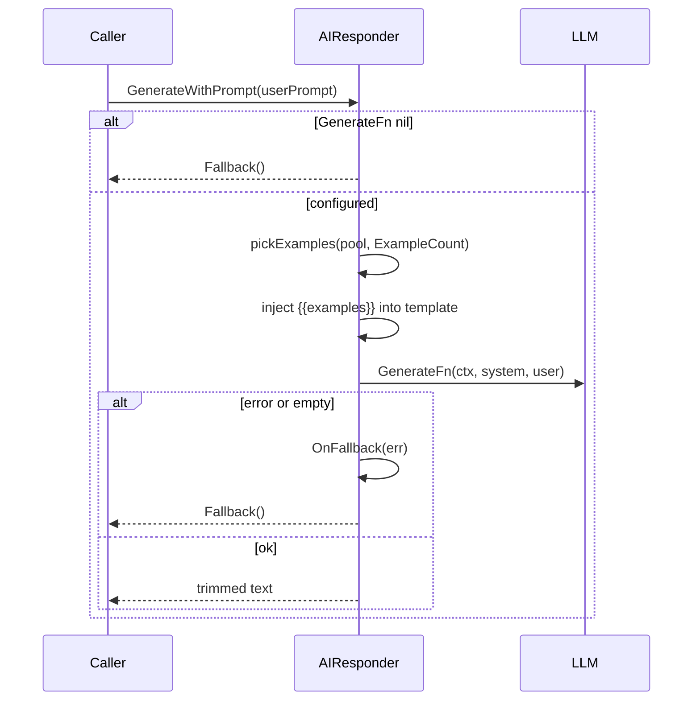

# util

Directory `internal/util`. Shared helpers. Not user-facing.

- `AIResponder` – LLM generation with few-shot examples + deterministic fallback (used by eso, coffee).
- `discordhelper.go` – channel/guild names, member lists, mention resolve/restore, user lookup, emoji reactions queue.
- `season.go` – `Season` detection, Easter computus (Meeus-Jones-Butcher).
- `util.go` – `RandomRange`, emoji byte constants.

## AIResponder generation

`ReactOnMessage` enqueues onto a single worker goroutine; `ResolveMentionsWithRestore` returns a restore func mapping display names back to `<@id>` tokens.
