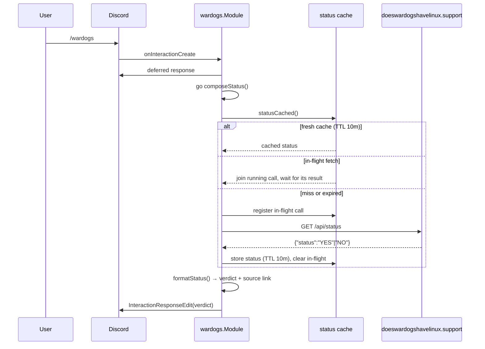

# wardogs

Directory `internal/wardogs`. Implements `bot.Module`.

Command `/wardogs` reports whether WARDOGS officially supports Linux/Proton. The
verdict comes from the community tracker `doeswardogshavelinux.support`, which
follows BULKHEAD's official statements.

- Endpoint: `GET https://doeswardogshavelinux.support/api/status` → `{"status":"NO"}`
- Cache: 10 min TTL for the parsed status **with single-flight grouping** — callers
  that arrive on a cold or expired cache join the running fetch instead of starting
  their own, so a burst causes one upstream request and cannot trip the host's
  `x-ratelimit-limit: 5`.
- Failures are never cached and clear the in-flight slot: the error path answers with
  a short retry hint and the next call fetches again.
- The tracker value echoed into an `Unknown` reply is sanitised (no backticks,
  newlines or control characters) and capped at `maxStatusDisplayLen` runes; the whole
  reply is clamped to Discord's `maxContentRunes` limit, so a hostile or oversized
  tracker response cannot make the deferred edit fail.
- Sources in the reply: the tracker is named as the source, the Steam forum hub is
  linked for a manual check. A pinned statement is deliberately **not** cited — it
  goes stale the moment the verdict flips to YES.
- Every URL is wrapped in angle brackets (`<url>`) because Discord otherwise
  attaches a link preview, which clutters the reply.

## Reply shape

```text
❌ **No** — WARDOGS does not officially support Linux/Proton yet.

**Sources**
• Tracker: <https://doeswardogshavelinux.support/>
• Steam discussions (check manually): <https://steamcommunity.com/app/1867240/discussions/>
```

## Command flow


