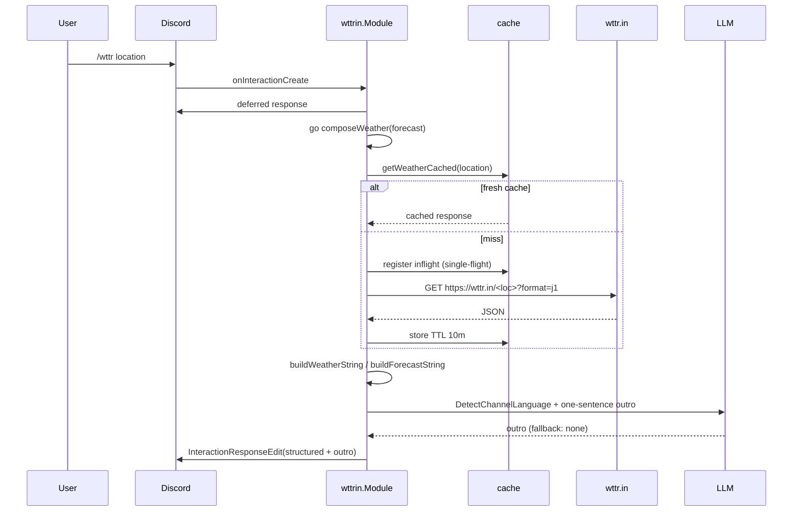

# wttrin

Directory `internal/wttrin`. Implements `bot.Module`.

Commands `/wttr` (current) and `/wttrf` (multi-day forecast). Fetches JSON from `wttr.in`, formats an emoji table, appends an LLM-written one-line outro in the channel language.

- Cache: 10 min TTL per location, single-flight dedup.
- LLM: injected via `Deps.LLM` (`GenerateMessageWith`), else global `llm.GenerateMessage`.

## Weather flow

